# BCIT COMP8005 Assignment 2 - Multi-Threaded, Select, & Epoll Servers

Originally Submitted by Nishan Vivekanandan & Reymon Mercado

# Objective

The objective of this assignment is to compare the scalability and
performance of the select-, multi-threaded-, and epoll-based
client-server implementations.

To achieve this, we have to design three servers: a traditional
multi-threaded server, a multiplexed select (level-triggered) server,
and an asynchronous epoll (edge-triggered) server. All the servers have
to be designed to handle multiple connections and transfer a specified
amount of data to a connected client. We also have to design a client
that will have the ability to send variable-length text strings to the
server and the number of times to send the strings will be a
user-specified value. The client will need to maintain the connection
for varying time durations. The idea is to keep increasing the load on
the server until its performance degrades quite significantly. Doing
this will measure the scalability and performance of the server (how
many connections it can handle and how fast) it can deliver the data
back to the clients.

# Constraints

  - The server has to maintain a list of all connected clients (host
    names) and store the list together with the number of requests
    generated by each client and the amount of data transferred to each
    client

  - Each client has to maintain a record of how many requests it made to
    the server, the amount of data sent to the server, and the amount of
    time it took for the server to respond

  - Summarize all data and findings in a properly formatted technical
    report and we should make extensive use of tables and graphs to
    support your findings and conclusions.

# Application Design 

*Language: Python 2.7*

*Environment: Linux*

## Description

#### Program Structure (for the Multi-Threaded Server)

The multi-threaded server follows a basic design. The main processes
listen on the server socket for incoming connections.

On receiving the connection, a client socket is created and passed to a
spawned thread for handling. The client handling thread then performs
the echo with the client until the client terminates the connection or
an error has occurred.

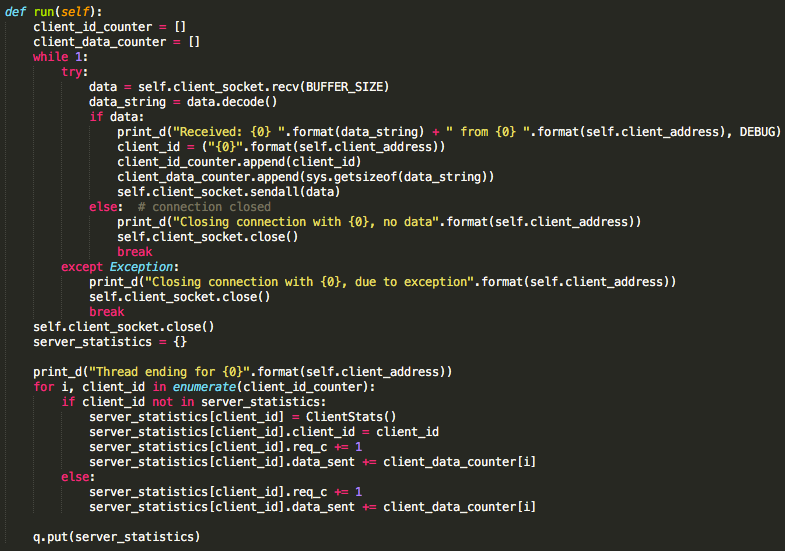

It then closes the connection and publishes its recorded connection
statistics back to the main process by use of a write\_stats function.

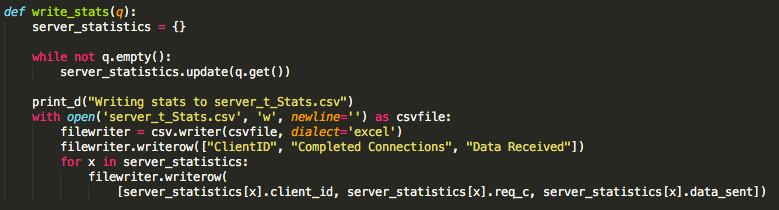

The main processes will run indefinitely until the user terminates the
program with Ctrl-C. It then gathers and writes the recorded connection
statistics to a csv file.

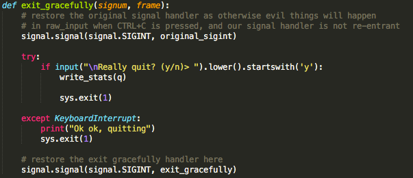

#### 

#### Program Structure (for the Select Server)

This server utilises the Select() function for asynchronous socket
handling in a single thread. The main sever socket is created and added
to the list of sockets that select will monitor. In the main loop select
is called against the socket list. If the server socket is ready to read
due to a client connection a client socket is created and added to the
socket list. The Select() statement is run again against the list. As
sockets are ready for reading, writing or have an error detected they
are put into corresponding socket lists/sets. The main loop then goes
through the lists reading from the read list

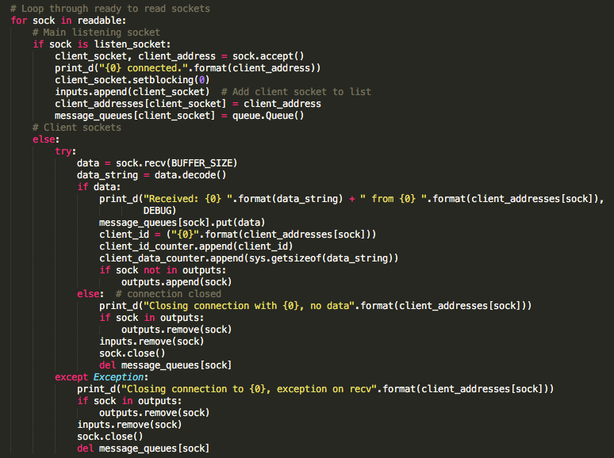

and writing to the sockets in the write list.

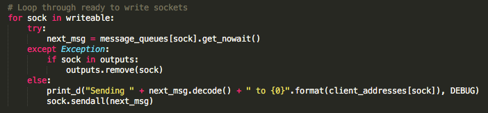

If the socket is in the error/exception list, the socket is closed and
removed from the main socket list.

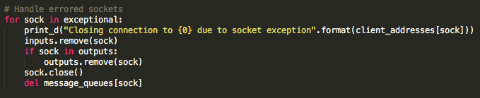

Statistics are gathered on socket reads and are complied and written to
disk on server termination.

#### Program Structure (for the Epoll Server)

The epoll server is similar to the select server but instead uses the
epoll() function in edge-triggered mode. On before the main loop the
server socket is registered with the epoll object to trigger events on
EPOLLIN (ready to read).

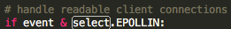

The main loop is then started. When epoll() detects the server socket
has received a connection its FD is added to the event list. The main
loop then checks all the events that have the EPOLLIN flag set, if it is
the server socket is knows a client connection was made and creates a
new client socket. This client socket is then registered with EPOLLIN.

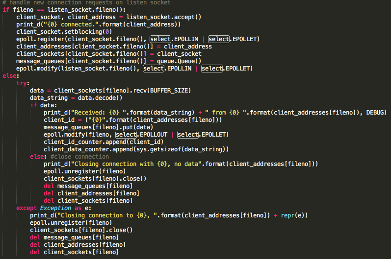

The loop processes EPOLLIN events and EPOLLOUT events in that order.
When a client connection is ready to read its messaged is stored and the
socket then registered with EPOLLOUT. When the EPOLLOUT section of the
loop is reached the message is echoed back to the client.

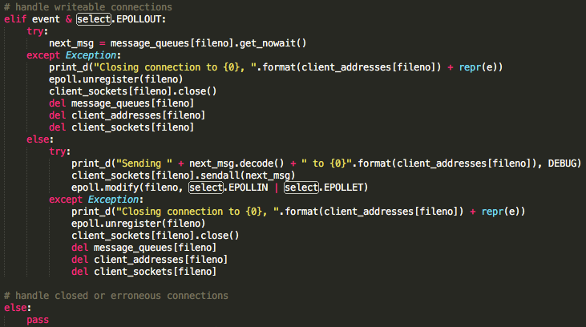

Both sections of the loop handle will also close and unregister the
socket when appropriate. Upon program termination the connection
statistics are compiled and written to a csv file.

## Pseudo-Code

#### Server\_e.py (Epoll Server)

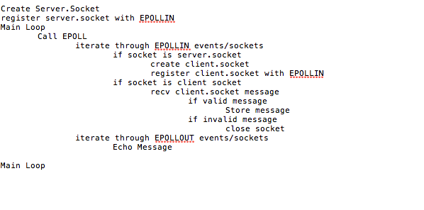

#### Server\_t.py (Multi-Threaded Server)

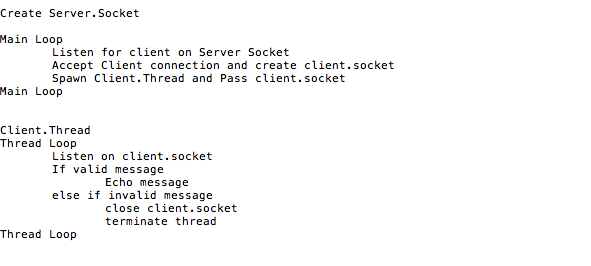

#### Server\_s.py (Select Server)

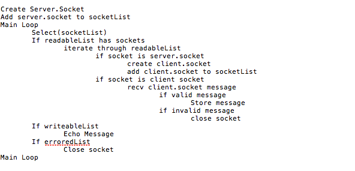

## Diagrams

#### Epoll Server Diagram

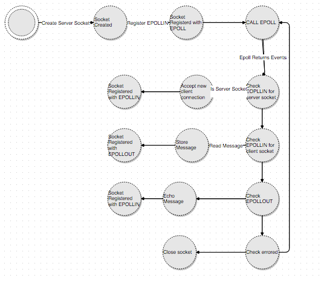

#### Multi-Threaded Server Diagram

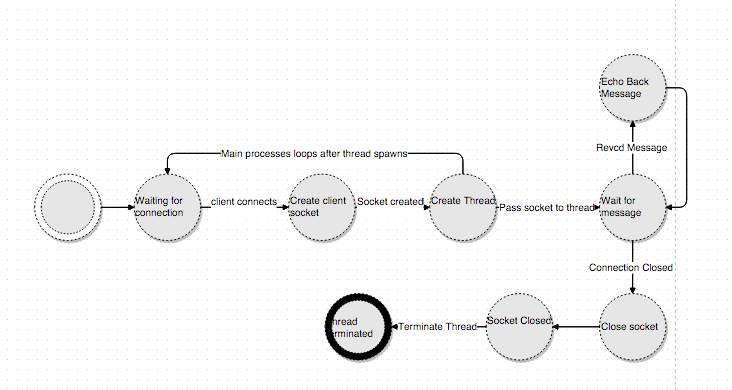

#### 

#### Select Server Diagram

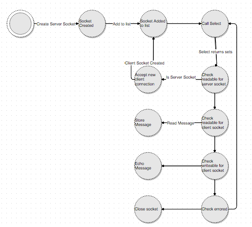

# Testing & Results

*Execution Instructions for the Client (client\_pt.py):*

1.  Navigate to COMP8005\_Assignment2 via Terminal.

2.  Within Terminal, enter the command: ‘python3 client.py \[enter IP\]’

3.  If you’d like to change the number of connections, you’d have to
    change the 'PROC\_NUM’ value and the ‘THREAD\_PER\_PROC’ value
    within the client\_pt.py file.
    
    1.  For example, if you wanted 1000 connections, you’d change the
        value of ‘PROC\_NUM’ to 500 and ‘THREAD\_PER\_PROC’ to 2

4.  If you’d like to change the number of times the message is sent and
    repeated, you’d have to change the ‘REPEAT’ value within the
    client\_pt.py file.

*Execution Instructions for the Multi-Threaded Server (server\_t.py):*

1.  Navigate to COMP8005\_Assignment2 via Terminal.

2.  Within Terminal, enter the command: ‘python3 server\_t.py’

*Execution Instructions for the Select Server (server\_s.py):*

1.  Navigate to COMP8005\_Assignment2 via Terminal.

2.  Within Terminal, enter the command: ‘python3 server\_s.py’

*Execution Instructions for the Epoll Server (server\_e.py):*

1.  Navigate to COMP8005\_Assignment2 via Terminal.

2.  Within Terminal, enter the command: ‘python3 server\_e.py’

## Test Case \#1 

Parameters:

  - Number of connections: 1000

  - Number of times message sent per request: 20

  - Port: 10000

  - Message: “This is the payload”

## Test Case \#2

Parameters:

  - Number of connections: 2000

  - Number of times message sent per request: 20

  - Port: 10000

  - Message: “This is the payload”

## 

## Test Case \#3

Parameters:

  - Number of connections: 3000

  - Number of times message sent per request: 20

  - Port: 10000

  - Message: “This is the payload”

## Test Case \#4

Parameters:

  - Number of connections: 4000

  - Number of times message sent per request: 20

  - Port: 10000

  - Message: “This is the payload”

## Test Case \#5

Parameters:

  - Number of connections: 5000

  - Number of times message sent per request: 20

  - Port: 10000

  - Message: “This is the payload”

## 

## Test Case \#6

Premise: We tested our select servers on their own, as we knew they
could not handle loads over 1024 connections. Basically, we just tested
our select server with connections of 1023 on a single thread. Then, we
tested it with 2000 connections on two threads.

Parameters:

  - Number of connections: 1023 and 2000

  - Number of times message sent per request: 20

  - Port: 10000

  - Message: “This is the payload”

